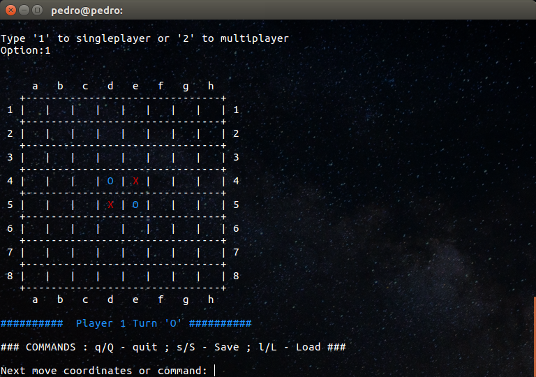
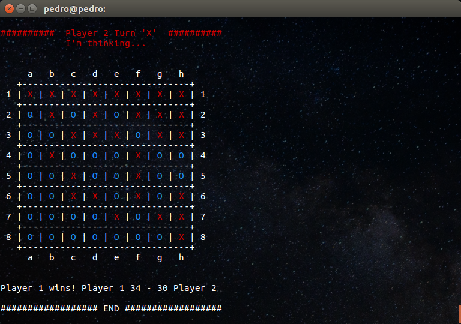

# Othello/Reversi Game 

This is an individual assigment to Automation and Industrial Robotics Project (PARI - Projecto em Automação e Robótica Industrial) at University of Aveiro.

The goal was to program the Othello/Reversi Game to be played in the terminal. It is possible to play against the computer by choosing singleplayer or against another player by choosing multiplayer. The computer plays randomly within the rules of the game.

 

When there are no possible moves the game ends and there's a winner.

The player plays by writing the cell coordinates in the terminal from A1 to H8. If the play isn't possible it will be asked for a new coordinate. If the player presses "Q" or "q" the game quits, "S" or "s" to save game to "othello.txt" and "L" or "l" to load game from "othello.txt".

Pedro Conceição - Aveiro - 11/11/2017

Masters in Industrial Automation Engineering. 
